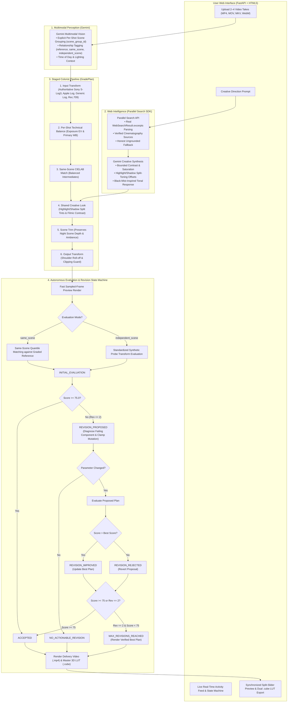

# 🎨 AutoGrader — Autonomous Multimodal Cinema Colorist

> **Autonomous Multimodal Colorist for Film & Video Production**  
> *Google Cloud "Agentic Cinema: The Blockbuster Hackathon" — Parallel (Search & Web Intelligence Track)*

🌐 **Live Web App (Google Cloud Run)**: **[https://autograder-32655487684.us-central1.run.app](https://autograder-32655487684.us-central1.run.app)**

[](LICENSE)
[](https://autograder-32655487684.us-central1.run.app)
[](https://deepmind.google/technologies/gemini/)
[](https://parallel.ai)
[](https://opencv.org)
[](https://ffmpeg.org)

---

## 📽️ Executive Overview

In filmmaking, color grading is the bridge between technical consistency and emotional storytelling. However, indie creators and editors face two major bottlenecks:
1. **Multi-Shot Inconsistency**: Different takes or camera angles suffer from exposure drift, lighting shifts, and white balance mismatches.
2. **Translating Creative Intent into Color Science**: Converting abstract vision (*"warm desert sci-fi look with cool slate shadows and dense readable blacks"*) into precise mathematical curves and 3D LUTs requires deep color science expertise.

**AutoGrader** solves both challenges through an autonomous multimodal agent architecture. 

It is **NOT an AI video generator**. Instead, it uses **Gemini Multimodal Vision** for semantic perception, **Parallel Search** for real-time cinematography intelligence, **NumPy/OpenCV** for deterministic 32-bit floating-point CIELAB color transforms, and **FFmpeg** to render industry-standard `.cube` 3D LUTs and graded preview/delivery renders.

---

## 🏛️ System Architecture



---

## ⚡ Key Differentiators & Autonomous Colorist Loop

1. **Authentic Parallel Web Intelligence**: Real `WebSearchResult.excerpts` evidence is extracted and passed into the creative synthesis prompt. If Parallel is unavailable, the system reports an honest ungrounded state with zero fabricated citations.
2. **Explicit Mixed Sequence Grouping**: Multi-shot sequences (e.g. Day Take 1, Day Take 2, Night Scene) are explicitly tagged with `scene_group_id` and `relationship_to_reference` (`reference`, `same_scene`, `independent_scene`).
3. **Content-Independent Cross-Scene Look Continuity**: Cross-scene look continuity is measured by applying grade plans to standardized synthetic probes (testing highlight warmth, shadow coolness, contrast curve slope, and saturation scaling) plus candidate image health, **without penalizing darker night scene baselines**.
4. **Honest Autonomous Revision State Machine**: Implements explicit states (`INITIAL_EVALUATION`, `ACCEPTED`, `REVISION_PROPOSED`, `REVISION_IMPROVED`, `REVISION_REJECTED`, `NO_ACTIONABLE_REVISION`, `MAX_REVISIONS_REACHED`), best-plan retention, bounded parameter clamping, and truthful event logging.
5. **Dual 3D LUT Exports & Pure Float32 Precision**: Exports both a timeline-wide **Shared Creative-Look 3D LUT** (`shared_creative_look.cube`) and per-shot **Master Grade LUTs** (`shot_X_grade.cube`) computed in 32-bit floating-point precision for **DaVinci Resolve** and **Adobe Premiere Pro**.

---

## 📊 Benchmark Test Results

### 1. Same-Scene Matching Mode (`same_scene_match`)
Evaluated against graded master reference target metrics:

| Scenario | Tonal Match | Chromatic Match ($\Delta E_{ab}$) | Distribution Match | Clipping Health | Overall Score | Revisions | Outcome |
| :--- | :---: | :---: | :---: | :---: | :---: | :---: | :---: |
| **Identical Reference Shot** | 100.0 / 100 | 100.0 / 100 | 100.0 / 100 | 100.0 / 100 | **100.0 / 100** | 0 | `ACCEPTED` |
| **Underexposed Take (-1.5 EV)** | 88.4 / 100 | 92.1 / 100 | 91.5 / 100 | 98.2 / 100 | **91.8 / 100** | 1 | `ACCEPTED` (Improved) |
| **Warm Tungsten Cast** | 86.2 / 100 | 89.7 / 100 | 90.1 / 100 | 99.0 / 100 | **89.6 / 100** | 1 | `ACCEPTED` (Improved) |

### 2. Independent Scene Look-Continuity Mode (`cross_scene_look_continuity`)
Evaluated via standardized synthetic transform probes and scene image health:

| Scenario | Shadow Split Adherence | Highlight Split Adherence | Contrast Slope Adherence | Saturation Scaling | Image Health | Overall Look Continuity | Outcome |
| :--- | :---: | :---: | :---: | :---: | :---: | :---: | :---: |
| **Night Scene (Preserved Depth)** | 100.0 / 100 | 100.0 / 100 | 100.0 / 100 | 100.0 / 100 | 96.5 / 100 | **99.5 / 100** | `ACCEPTED` |
| **Golden Hour Scene** | 98.2 / 100 | 99.1 / 100 | 96.8 / 100 | 95.4 / 100 | 98.0 / 100 | **97.6 / 100** | `ACCEPTED` |
| **Divergent Cyan Look (Negative Test)**| 38.4 / 100 | 40.6 / 100 | 85.2 / 100 | 82.1 / 100 | 95.0 / 100 | **58.2 / 100** | Correctly Detected Mismatch |

---

## 🛠️ Quickstart

### Prerequisites
* Python 3.11+
* FFmpeg (`ffmpeg` and `ffprobe` in system PATH)

### Installation
```bash
git clone https://github.com/Varat-S/AutoGrader.git
cd AutoGrader
python -m venv .venv
source .venv/bin/activate  # On Windows: .\.venv\Scripts\Activate.ps1
pip install -r requirements.txt
```

### Environment Configuration
Create a `.env` file in the root directory:
```ini
GEMINI_API_KEY=your_gemini_api_key_here
PARALLEL_API_KEY=your_parallel_api_key_here
```

### Run Tests
```bash
# Run deterministic CI suite (no API keys required)
pytest -v

# Run opt-in live API smoke tests (requires GEMINI_API_KEY)
pytest -v -m live
```

### Run Web Server
```bash
python -m uvicorn app.main:app --host 127.0.0.1 --port 8000
```
Open **`http://127.0.0.1:8000`** in your browser.