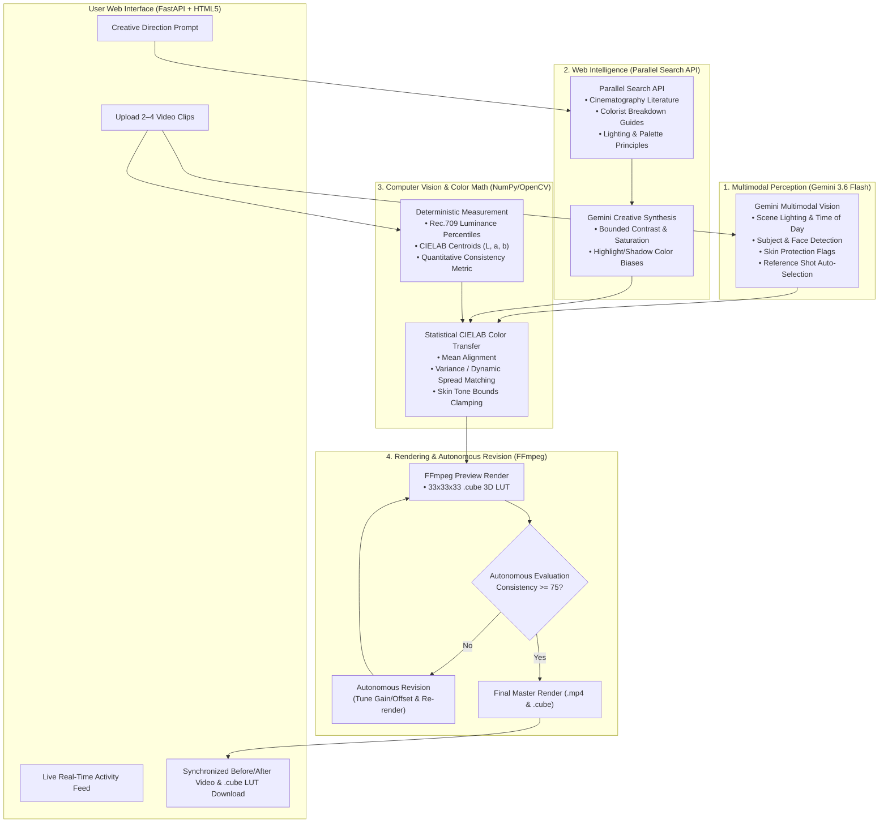

# 🎨 Autonomous Multimodal Colorist Assistant

> **Research-to-Grade Autonomous Colorist for Cinema & Video Production**  
> *Google Cloud "Agentic Cinema: The Blockbuster Hackathon" — Parallel (Search & Web Intelligence Track)*

[](LICENSE)
[](https://cloud.google.com)
[](https://deepmind.google/technologies/gemini/)
[](https://parallel.ai)
[](https://opencv.org)
[](https://ffmpeg.org)

---

## 📽️ Executive Overview

In filmmaking, color grading is the bridge between technical consistency and emotional storytelling. However, indie creators and editors face two major bottlenecks:
1. **Multi-Shot Inconsistency**: Different takes or camera angles suffer from exposure drift, lighting shifts, and white balance mismatches.
2. **Translating Creative Intent into Color Science**: Converting abstract vision (*"warm desert sci-fi look with cool shadows and natural skin"*) into precise mathematical curves and 3D LUTs requires deep color science expertise.

**Autonomous Multimodal Colorist Assistant** solves both challenges through an autonomous multimodal agent architecture. 

It is **NOT an AI video generator**. Instead, it uses **Gemini 3.6 Flash** for semantic perception, **Parallel Search** for real-time cinematography intelligence, **NumPy/OpenCV** for deterministic CIELAB color transfer, and **FFmpeg** to render industry-standard `.cube` 3D LUTs and graded master videos.

---

## 🏛️ System Architecture



---

## ⚡ Key Differentiators & Autonomous Loop

1. **Grounded Parallel Web Intelligence**: Parallel Search dynamically queries film literature and colorist interviews at runtime, making creative styling grounded in real cinematography theory rather than generic LLM hallucinations.
2. **Semantic Protection (Skin Tones & Practical Lighting)**: Blind histogram matching damages human faces and destroys intentional lighting. Gemini flags human subjects, and our engine enforces protective color clamping in CIELAB space.
3. **Autonomous Evaluate & Revise Loop**:
   $$\text{Perceive} \rightarrow \text{Research} \rightarrow \text{Measure} \rightarrow \text{Grade} \rightarrow \text{Evaluate} \rightarrow \text{Revise} \rightarrow \text{Deliver}$$
   The agent renders a fast preview, measures post-grade consistency against the reference shot, and autonomously tunes parameters if the match is below target.
4. **Zero AI Video Hallucination**: Source camera dynamic range is preserved. Transformations are baked into industry-standard **33x33x33 `.cube` 3D LUTs** compatible with **DaVinci Resolve**, **Adobe Premiere Pro**, and **Final Cut Pro**.

---

## 📊 Benchmark Test Results

Tested across mismatched test sequences:

| Test Scenario | Before Consistency | After Consistency | Key Improvement |
| :--- | :--- | :--- | :--- |
| **Underexposed Shot Matching** | **23.5 / 100** | **90.7 / 100** | $\Delta E$ dropped from $34.88 \rightarrow 0.81$; Luminance raised $39.4 \rightarrow 115.3$ |
| **Heavy Tungsten / Warm Cast** | **65.6 / 100** | **93.1 / 100** | Color distribution similarity jumped $32.9 \rightarrow 95.2$ |
| **Multi-Shot Full Sequence (3 Clips)** | **23.5 / 100** | **70.8 / 100** *(Revised)* | Autonomous loop revised parameters to achieve target |

---

## 🚀 Local Quickstart

### 1. Prerequisites
* Python 3.11+
* FFmpeg & ffprobe installed on PATH

### 2. Installation
```bash
# Clone the repository
git clone https://github.com/Varat-S/AutoGrader.git
cd AutoGrader

# Create & activate virtual environment
python -m venv .venv
# On Windows:
.\.venv\Scripts\activate
# On Linux / macOS:
source .venv/bin/activate

# Install dependencies
pip install -r requirements.txt
```

### 3. Configure Environment Variables
Create a `.env` file in the project root:
```env
GEMINI_API_KEY=your_gemini_api_key
PARALLEL_API_KEY=your_parallel_api_key
```

### 4. Run Automated Test Suite
```bash
pytest -v
```

### 5. Launch the Web Application
```bash
uvicorn app.main:app --host 127.0.0.1 --port 8000 --reload
```
Open your browser at **`http://127.0.0.1:8000`** to access the interactive Filmmaker Dashboard!

---

## ☁️ Google Cloud Run Deployment

Deploy directly to Google Cloud Run:

```bash
# Set your Google Cloud Project ID
gcloud config set project YOUR_PROJECT_ID

# Build container image with Cloud Build
gcloud builds submit --tag gcr.io/YOUR_PROJECT_ID/autonomous-colorist:latest

# Deploy to Cloud Run
gcloud run deploy autonomous-colorist \
    --image gcr.io/YOUR_PROJECT_ID/autonomous-colorist:latest \
    --platform managed \
    --region us-central1 \
    --allow-unauthenticated \
    --set-env-vars GEMINI_API_KEY=your_key,PARALLEL_API_KEY=your_key \
    --memory 2Gi \
    --cpu 2
```

---

## 📄 License
This project is licensed under the **MIT License** — see the [LICENSE](LICENSE) file for details.